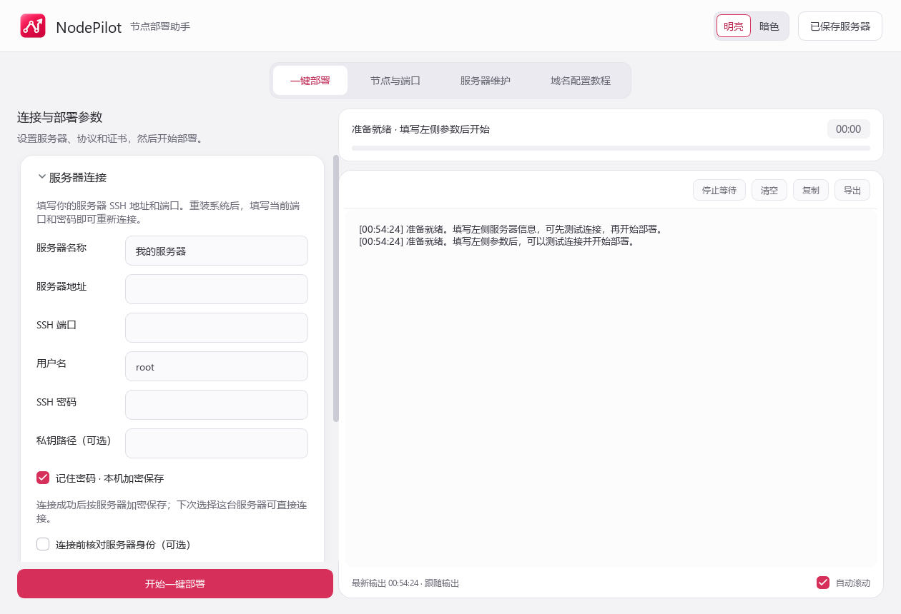
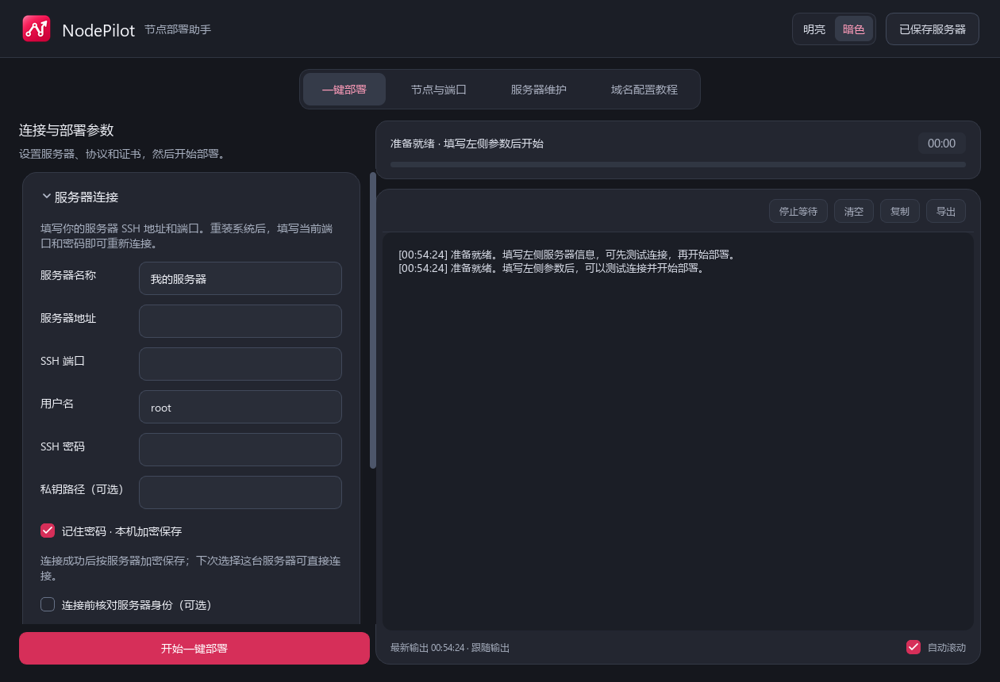
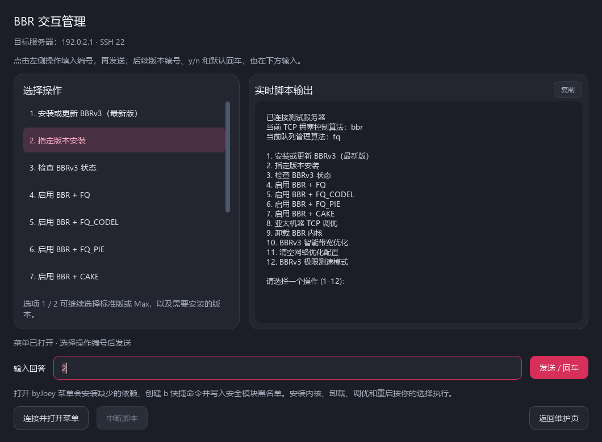

<p align="center"></p>

# NodePilot · VPS 一键部署工具

**在 Windows 上连接 Debian VPS，一键部署 3x-ui、VLESS REALITY 与 Hysteria2，并管理端口、证书、BBR 和 SSH / 面板防爆破。**

当前版本：**v1.6.5**。NodePilot 是面向 Debian 12 的 Windows 桌面 VPS 部署工具。左侧填写配置，右侧实时显示执行日志；部署完成后直接获取节点链接、面板地址和账号信息。支持明亮 / 暗色主题，关闭软件后保留主题选择。

[下载 Windows 最新版](https://github.com/Mr-Lee-951219/vps-one-click-deployer/releases/latest) · [完整使用说明](docs/user-guide.md) · [源码构建](#源码运行与构建) · [第三方组件](THIRD_PARTY_NOTICES.md)

## 界面预览

| 明亮主题 | 暗色主题 |
| --- | --- |
|  |  |

界面截图使用空白连接信息，未包含真实服务器地址、密码或部署结果。

### BBR 选择与输入



左侧点击选择，右侧查看输出，下方输入框发送编号、y/n 或默认回车。上图使用示例输出和文档保留地址，不包含真实服务器信息。

## 主要功能

| 功能 | 说明 |
| --- | --- |
| 一键部署 | 通过 SSH 安装固定版本 3x-ui，创建 VLESS REALITY Vision 和 / 或 HY2 节点 |
| 实时输出 | 常驻执行日志、步骤进度与耗时；支持复制、导出、暂停滚动和停止等待 |
| 灵活端口 | 显示随机端口，也可手动填写；生成准确的 TCP / UDP 放行清单 |
| 面板入口 | 无域名时提供 HTTP IP 链接；配置域名证书后提供 HTTPS 域名链接 |
| 证书管理 | HY2 自签证书与指纹、域名证书申请、有效期检查、续期及部署后添加域名 |
| BBR 管理 | 查看真实版本与队列；byJoey 12 项菜单可点击选择，输入框支持版本编号、y/n 和默认回车 |
| 服务器维护 | 服务、日志、监听与防火墙检查，节点连通性和限量测速、日期与流量配额 |
| SSH / 面板防爆破 | 独立 Fail2ban 规则保护 SSH 和 3x-ui 面板登录，支持白名单、递增封禁、停用、恢复与单 IP 解封 |
| 防护统计 | 登录失败 IP 数、失败次数、封禁次数、当前封禁和 IP 明细，支持筛选与导出 |
| 服务器列表 | 保存连接记录，可选本机加密保存 SSH 密码，支持选择连接及删除记录 |
| 备份恢复 | 加密导出部署备份，支持同一服务器恢复及继续未完成的部署 |
| 外观切换 | 明亮 / 暗色即时切换，保留输入、当前页面、折叠状态和日志 |

## 支持环境

| 项目 | 当前支持范围 |
| --- | --- |
| 桌面电脑 | Windows 10 / 11，x64 |
| VPS 系统 | Debian 12，x86_64，需要 root SSH 访问 |
| 3x-ui | v3.9.0，固定版本部署 |
| 节点协议 | VLESS REALITY Vision、Hysteria2（HY2 / QUIC） |
| Windows 客户端 | 节点链接可导入 v2rayN；需要使用支持对应协议的客户端版本 |
| 节点测试核心 | Xray 26.9.30，来源及校验记录见 assets/core/provenance.json |

Debian 12 是本软件当前支持范围，不代表 3x-ui 仅支持这个系统版本。

## 下载与使用

普通用户请在本仓库的 [**Releases**](https://github.com/Mr-Lee-951219/vps-one-click-deployer/releases/latest) 页面下载 `NodePilot-v1.6.5-Windows-x64.zip`。`source.zip` 是源码包，供开发和审查使用。

1. **完整解压 Windows 压缩包**，双击 `NodePilot.exe`。保留旁边的 `_internal` 文件夹，无需安装 Python。
2. 确认 VPS 已安装 Debian 12 x86_64；填写服务器地址、实际 SSH 端口、用户名和密码 / 私钥，先测试连接。
3. 选择协议，设置面板账号、密码和节点端口。需要 HY2 时，先选择并确认其证书方式。
4. 有域名时，按软件教程添加灰云 A 记录并配置域名证书；没有域名也可部署 VLESS 或使用自签证书的 HY2。
5. 点击“一键部署”，通过右侧实时窗口查看结果。
6. 按实际端口在服务商安全组放行，并确认规则已绑定 VPS；测试节点后导入客户端。

部署结果提供面板链接、账号、密码及复制按钮。已部署后可以添加域名或使用维护功能，不必因此重装节点。

详细教程见 [完整使用说明](docs/user-guide.md)。教程中的域名均为示例，需要替换为自己的域名。

## 端口与证书

- **SSH、面板、VLESS TCP 和 HY2 UDP 端口分别配置**；SSH 不一定是 22，节点也不一定是 443。
- 软件可通过 SSH 配置服务器本机规则；服务商的外部安全组需要在后台放行。当前提供 RakSmart 规则说明与精确清单，不提供云安全组 API 自动授权。
- 域名证书流程使用灰云 A 记录和 HTTP-01 验证，需要域名已生效并放行 TCP 80。软件不要求填写 Cloudflare Token 或证书联系邮箱。
- VLESS REALITY 和 HY2 QUIC 节点域名使用 **仅 DNS / 灰云**；此流程不通过 Cloudflare 橙云代理节点流量。
- 没有域名时，面板使用 HTTP IP 链接，浏览器会提示连接不安全；HY2 的自签证书指纹不能替代浏览器信任的面板 HTTPS 证书。
- 在“服务器维护 → 防爆破”选择 SSH 或 3x-ui 面板登录，分别启用规则；面板防护适配 3x-ui v3.9.0 的直连公网端口，HTTP / HTTPS 均可，反向代理或橙云入口需单独适配。
- 系统 BBR 作用于 TCP；HY2 的 QUIC 拥塞控制由 HY2 内核管理。安装 byJoey BBRv3 内核需要重启 VPS，安装完成与重启生效会分别显示。
- 在“服务器维护 → BBR 管理”打开 byJoey 菜单，连接后点击操作编号并发送；可选择标准 / Max、指定版本、FQ / FQ_CODEL / FQ_PIE / CAKE 等。脚本实时输出，后续提示用同一个输入框回答。

## 密码与本机数据

软件不预置服务器、SSH 密码或个人域名。SSH 密码由用户输入；勾选“记住密码”且登录成功后，使用 Windows DPAPI 加密保存到当前用户的本机数据目录，未勾选时只用于本次连接。

保存的密码绑定当前 Windows 用户，不随发布压缩包共享到其他电脑。认证失败不会覆盖以前成功保存的密码；删除服务器记录也会清除对应的已保存登录密码。私钥文件不打包上传。

部署记录、证书和加密备份可能包含敏感信息，请不要上传到公开仓库或公开 Issue。提交问题时说明软件版本、系统和复现步骤，并隐藏日志中的登录信息。

SSH 默认允许服务器重装后更新身份记录并重连；需要人工核对时，可以勾选“连接前核对服务器身份”。

## 源码运行与构建

构建环境使用 Windows x64、Python 3.13 验证。依赖版本固定在 [requirements.txt](requirements.txt)。

在项目根目录的 PowerShell 中执行：

```powershell
git clone https://github.com/Mr-Lee-951219/vps-one-click-deployer.git
cd vps-one-click-deployer
python -m venv .venv
.\.venv\Scripts\python.exe -m pip install -r requirements.txt
.\.venv\Scripts\python.exe tools/fetch_core.py
.\.venv\Scripts\python.exe main.py
```

`tools/fetch_core.py` 从固定版本的 3x-ui 官方发布包下载测试用 Xray 核心，并验证 SHA-256。仓库不提交此 EXE；Windows 发布包已包含运行所需核心。

运行测试：

```powershell
.\.venv\Scripts\python.exe -m pytest -q
```

构建便携包：

```powershell
powershell -ExecutionPolicy Bypass -File .\build.ps1
```

构建后在 `dist/` 中生成版本号 Windows 便携 ZIP 和源码 ZIP。版本号来自 `deployer/__init__.py`。

## 最新版验证范围

本自述文件和 [使用教程](docs/user-guide.md) 只介绍 **v1.6.5** 的功能与操作。

- 完整回归测试通过 **164 项**，覆盖连接与凭据、证书设置、端口、节点导出、维护、SSH / 面板防护、统计和主题切换。
- 明暗主题及弹窗完成截图检查，暗色界面在 150% 显示缩放下完成检查。
- 便携包已完整解压，验证在没有 Python 命令路径的环境下可启动；源码包与对应项目文件一致。
- 面板真实端口与日志读取已在 Debian 12 上验证；在独立网络命名空间中验证了真实 Fail2ban / nftables 封禁及解封，未改动正式防护规则。
- BBR 交互已通过真实 SSH PTY 多轮输入检查，包含无换行提示、版本选择、y/n 和空白回车；该检查使用无修改行为的临时脚本，未在生产 VPS 执行安装或调优。

上述检查不代表所有服务商、网络或机器都已验证。真实云安全组、域名签发 / 自动续期及自己的生产防护效果，需要在自己的环境中确认；相关说明见使用教程。

## 项目结构

```text
deployer/          桌面界面、SSH 连接、部署与维护逻辑
assets/            固定脚本、图标、许可证与测试核心来源记录
docs/              使用说明和界面截图
tests/             自动化回归测试
tools/             构建、检查与可选开发诊断工具
design-system/     界面设计记录
build.ps1          Windows 便携包构建入口
```

## 第三方组件

NodePilot 使用或调用 3x-ui、Xray、acme.sh、PySide6 / Qt、Fail2ban 和 byJoey Actions-bbr-v3 等项目。它们各自的许可证、来源和说明见 [THIRD_PARTY_NOTICES.md](THIRD_PARTY_NOTICES.md) 与 `assets/` 中的许可证文件。

- [3x-ui](https://github.com/MHSanaei/3x-ui)
- [Xray-core](https://github.com/XTLS/Xray-core)
- [Hysteria](https://github.com/apernet/hysteria)
- [acme.sh](https://github.com/acmesh-official/acme.sh)
- [Fail2ban](https://github.com/fail2ban/fail2ban)
- [byJoey Actions-bbr-v3](https://github.com/byJoey/Actions-bbr-v3)
- [v2rayN](https://github.com/2dust/v2rayN)

## 反馈与贡献

欢迎通过本仓库的 Issues 提交可复现的问题或功能建议。请附软件版本、Windows / Debian 版本、操作步骤和隐藏敏感信息后的相关日志。修改源码后，请运行相关测试并在说明中写明验证范围。
